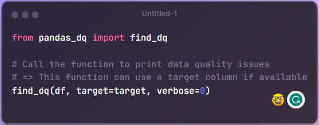
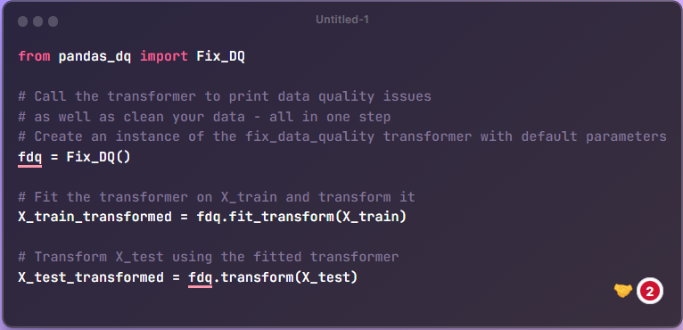
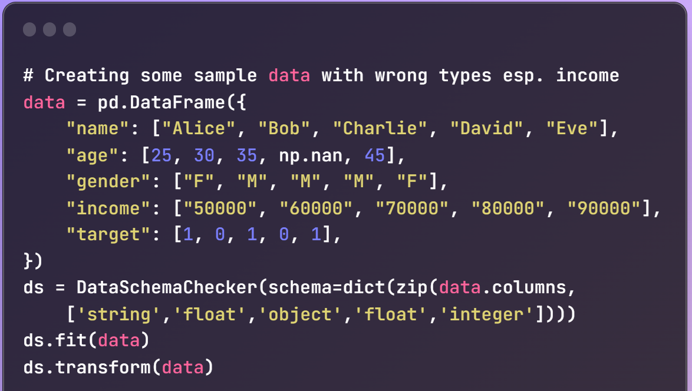
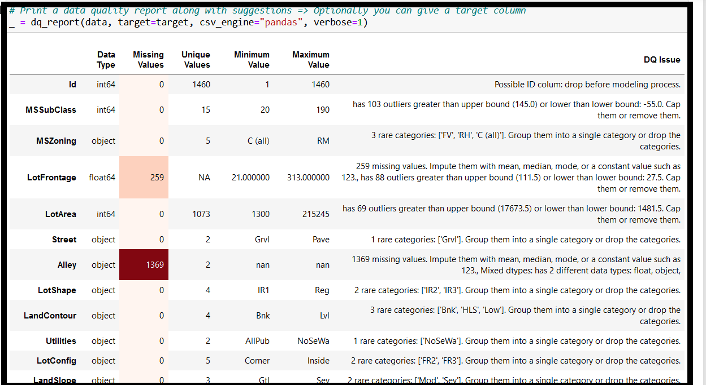

# pandas_dq
Analyze and clean your data in a single line of code with a Scikit-Learn compatible Transformer.

# Table of Contents
<ul>
<li><a href="#introduction">What is pandas_dq</a></li>
<li><a href="#uses">How to use pandas_dq</a></li>
<li><a href="#install">How to install pandas_dq</a></li>
<li><a href="#usage">Usage</a></li>
<li><a href="#api">API</a></li>
<li><a href="#maintainers">Maintainers</a></li>
<li><a href="#contributing">Contributing</a></li>
<li><a href="#license">License</a></li>
</ul>
<p>

## Introduction
`pandas_dq` is a new python library for data quality analysis and improvement. It is fast, efficient and scalable. 

<b>Alert!</b>: If you are using `pandas version 2.0` ("the new pandas"), beware that weird errors are popping up in all kinds of libraries that use pandas underneath. Our `pandas_dq` library is no exception. So if you plan to use `pandas_dq` with `pandas version 2.0`, beware that you may see weird errors and we can't and won't fix them!

### What is pandas_dq?
The new `pandas_dq` library in Python is a great addition to the `pandas` ecosystem. It provides a set of tools for data quality assessment, which can be used to identify and address potential problems with data sets. This can help to improve the quality of data analysis and ensure that results are reliable.

The `pandas_dq` library is still under development, but it already includes a number of useful features. These include:
- Data profiling: This allows you to get an overview of the data, including features, their data types, their values, and distribution.
- Data cleaning: This allows you to identify and remove errors and inconsistencies in the data.
- Data imputation: This allows you to fill in missing values in the data.
- Data transformation: This allows you to transform skewed features into a more normal-like distribution.

The `pandas_dq` library is a valuable tool for anyone who works with data. It can help you to improve the quality of your data analysis and ensure that your results are reliable.

Here are some of the benefits of using the pandas_dq library:
- It can help you to identify and address potential problems with data sets.
- It can improve the quality of data analysis.
- It can ensure that your results are reliable.
- It is easy to use and can be integrated with other `pandas` tools.
<ol>

`pandas_dq` has three main modules:
<li><b>dq_report</b>: This function prints a data quality report after it analyzes your dataset for various issues, such as missing values, outliers, duplicates, correlations, etc. It also checks the relationship between the features and the target variable (if provided) to detect data leakage.</li>
<li><b>Fix_DQ</b>: This class is a scikit-learn compatible transformer that can detect and fix data quality issues in one line of code. It can remove ID columns, zero-variance columns, rare categories, infinite values, mixed data types, outliers, high cardinality features, highly correlated features, duplicate rows and columns, skewed distributions and imbalanced classes.</li>
<li><b>DataSchemaChecker</b>: This class can check your dataset data types against a specific schema and report any mismatches or errors.</li>
</ol>

`pandas_dq` is designed to provide you the cleanest features with the fewest steps.


## Uses
`pandas_dq` has multiple important modules: `dq_report`, `Fix_DQ` and now `DataSchemaChecker`. <br>

### 1.  dq_report function



<p>`dq_report` prints a data quality report after it analyzes your dataset looking for these issues:
<ol>
<li>It detects ID columns</li>
<li>It detects zero-variance columns </li>
<li>It identifies rare categories (less than 5% of categories in a column)</li>
<li>It finds infinite values in a column</li>
<li>It detects mixed data types (i.e. a column that has more than a single data type)</li>
<li>It detects outliers (i.e. a float column that is beyond the Inter Quartile Range)</li>
<li>It detects high cardinality features (i.e. a feature that has more than 100 categories)</li>
<li>It detects highly correlated features (i.e. two features that have an absolute correlation higher than 0.8)</li>
<li>It detects duplicate rows (i.e. the same row occurs more than once in the dataset)</li>
<li>It detects duplicate columns (i.e. the same column occurs twice or more in the dataset)</li>
<li>It detects skewed distributions (i.e. a feature that has a skew more than 1.0) </li>
<li>It detects imbalanced classes (i.e. target variable has one class more than other in a significant way) </li>
<li>It detects feature leakage (i.e. a feature that is highly correlated to target with correlation > 0.8)</li>
</ol>
Notice that for large datasets, this report generation may take time, hence we read a 100K sample from your CSV file. If you want us to read the whole data, then send it in as a dataframe.

### 2.  Fix_DQ class: a scikit_learn transformer which can detect data quality issues and fix them all in one line of code



<p>`Fix_DQ` is a great way to clean an entire train data set and apply the same steps in an MLOps pipeline to a test dataset.  `Fix_DQ` can be used to detect most issues in your data (similar to dq_report but without the `target` related issues) in one step. Then it fixes those issues it finds during the `fit` method by the `transform` method. This transformer can then be saved (or "pickled") for applying the same steps on test data either at the same time or later.<br>
<p>Fix_DQ will perform following data quality cleaning steps:
<ol>
<li>It removes ID columns from further processing</li>
<li>It removes zero-variance columns from further processing</li>
<li>It identifies rare categories and groups them into a single category called "Rare"</li>
<li>It finds infinite values and replaces them with an upper bound based on Inter Quartile Range</li>
<li>It detects mixed data types and drops those mixed-type columns from further processing</li>
<li>It detects outliers and suggests to remove them or use robust statistics.</li>
<li>It detects high cardinality features but leaves them as it is.</li>
<li>It detects highly correlated features and drops one of them (whichever comes first in the column sequence)</li>
<li>It detects duplicate rows and drops one of them or keeps only one copy of duplicate rows</li>
<li>It detects duplicate columns and drops one of them or keeps only one copy</li>
<li>It detects skewed distributions and applies log or box-cox transformations on them </li>
<li>It detects imbalanced classes and leaves them as it is </li>
<li>It detects feature leakage and drops one of those features if they are highly correlated to target </li>
</ol>

<b>How can we use Fix_DQ in GridSearchCV to find the best model pipeline?</b>
<p>This is another way to find the best data cleaning steps for your train data and then use the cleaned data in hyper parameter tuning using GridSearchCV or RandomizedSearchCV along with a LightGBM or an XGBoost or a scikit-learn model.<br>

### 3.  DataSchemaChecker class: a scikit_learn transformer that can check whether a pandas dataframe conforms to a given schema and coerces the data to conform to it.
The DataSchemaChecker class has two methods: fit and transform. You need to initialize the class with a schema that you want to compare your data's dtypes against. A schema is a dictionary that maps column names to data types. 

The fit method takes a dataframe as an argument and checks if it matches the schema. The fit method first checks if the number of columns in the dataframe and the schema are equal. If not, it creates an exception. Finally, the fit method prints a table of exceptions it found in your data against the given schema. 

The transform method takes a dataframe as an argument and based on the given schema and the exceptions, converts all the exception data columns to the given schema. If it is not able to transform the column, it skips the column and prints out an error message.



## Install
<p>

**Prerequsites:**
<ol>
<li><b>pandas_dq is built using pandas, numpy and scikit-learn - that's all.</b> It should run on almost all Python3 Anaconda installations without additional installs. You won't have to import any special libraries.</li>
</ol>
The best method to install pandas_dq is to use pip:<p>

```
pip install pandas_dq 
```

To install from source:

```
cd <pandas_dq_Destination>
git clone git@github.com:AutoViML/pandas_dq.git
```
or download and unzip https://github.com/AutoViML/pandas_dq/archive/master.zip
```
conda create -n <your_env_name> python=3.7 anaconda
conda activate <your_env_name> # ON WINDOWS: `source activate <your_env_name>`
cd pandas_dq
pip install -r requirements.txt
```

## Usage
<p>
You can invoke `Fix_DQ` as a scikit-learn compatible fit and transform object. See syntax below.<p>

```
from pandas_dq import Fix_DQ

# Call the transformer to print data quality issues 
# as well as clean your data - all in one step
# Create an instance of the fix_data_quality transformer with default parameters
fdq = Fix_DQ()

# Fit the transformer on X_train and transform it
X_train_transformed = fdq.fit_transform(X_train)

# Transform X_test using the fitted transformer
X_test_transformed = fdq.transform(X_test)

```

### if you are not using the Transformer, you can simply call the function, dq_report

```
from pandas_dq import dq_report
dq_report(data, target=target, csv_engine="pandas", verbose=1)
```

It prints out a data quality report like this:



### If you are using the DataSchemaChecker class, you can try it with a schema like this:

```
        Example of a schema: all python dtypes must be surrounded by quote strings.
        schema = {'name': 'string',
         'age': 'float32',
         'gender': 'object',
         'income': 'float64',
         'target': 'integer'}
```

Once you define the schema above, you can use it as follows:

```
from pandas_dq import DataSchemaChecker

ds = DataSchemaChecker(schema=schema)
ds.fit_transform(X_train)
df.transform(X_test)
```

## API

<p>
pandas_dq has a very simple API with one major goal: find data quality issues in your data and fix them.

**Arguments**

`dq_report` has only 4 arguments:<br>
<b>Caution:</b> For very large data sets, we randomly sample 100K rows from your CSV file to speed up reporting. If you want a larger sample, simply read in your file offline into a pandas dataframe and send it in as input, and we will load it as it is. This is one way to go around our speed limitations.
- `data`: You can provide any kind of file format (string) or even a pandas DataFrame (df). It reads parquet, csv, feather, arrow, all kinds of file formats straight from disk. You just have to tell it the path to the file and the name of the file. 
- `target`: default: `None`. Otherwise, it should be a string name representing the name of a column in df. You can leave it as `None` if you don't want any target related issues.
- `csv_engine`: default is `pandas`. If you want to load your CSV file using any other backend engine such as `arrow` or `parquet` please specify it here. This option only impacts CSV files.
- `verbose`: This has 2 possible states:
  - `0` summary report. Prints only the summary level data quality issues in the dataset. Great for managers.
  - `1` detailed report. Prints all the gory details behind each DQ issue in your dataset and what to do about them. Great for engineers.

`Fix_DQ` has slightly more arguments:<br>
<b>Caution:</b> X_train and y_train in Fix_DQ must be pandas Dataframes or pandas Series. I have not tested it on numpy arrays. You can try your luck.

- `quantile`: float (0.75): Define a threshold for IQR for outlier detection. Could be any float between 0 and 1. If quantile is set to `None`, then no outlier detection will take place.
- `cat_fill_value`: string ("missing") or a dictionary: Define a fill value for missing categories in your object or categorical variables. This is a global default for your entire dataset. You can also give a dictionary where you specify different fill values for different columns.
- `num_fill_value`: integer (99) or float value (999.0) or a dictionary: Define a fill value for missing numbers in your integer or float variables.  This is a global default for your entire dataset. You can also give a dictionary where you specify different fill values for different columns.
- `rare_threshold`: float (0.05):  Define a threshold for rare categories. If a certain category in a column is less than say 5% (0.05) of samples, then it will be considered rare. All rare categories in that column will be merged under a new category named "Rare". 
- `correlation_threshold`: float (0.8): Define a correlation limit. Anything above this limit, if two variables are correlated, one of them will be dropped. The program will tell you which variable is being dropped. You can switch the sequence of variables in your dataset if you want the one or other dropped.<br>

`DataSchemaChecker` is very similar in that it is also a scikit-learn transformer. It checks you data against a given schema:<br>
What is a schema?
  `A schema (dict) is a dictionary that maps column names to data types.`

For Example: here is a schema with column names against their expected python dtypes (being surrounded by quote strings).

```
{'name': 'string',
  'age': 'float32',
  'gender': 'object',
  'income': 'float64',
  'target': 'integer'}
```

DataSchemaChecker has two methods:
- `fit` method: Checks if the dataframe matches the schema and prints a table of errors if any.
- `transform` method: Transforms the dataframe's dtypes to the given schema and prints errors if any.

## Maintainers

* [@AutoViML](https://github.com/AutoViML)

## Contributing

See [the contributing file](CONTRIBUTING.md)!

PRs accepted.

## License

Apache License 2.0 © 2020 Ram Seshadri

## Note of Gratitude

This libray would not have been possible without the help of ChatGPT and Bard. This library is dedicated to the thousands of people who worked to create LLM's. 

## DISCLAIMER
This project is not an official Google project. It is not supported by Google and Google specifically disclaims all warranties as to its quality, merchantability, or fitness for a particular purpose.


