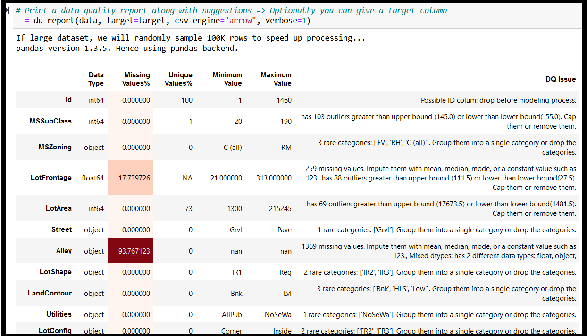

# pandas_dq
Analyze and clean your data in a single line of code with a Scikit-Learn compatible Transformer.

# Table of Contents
<ul>
<li><a href="#introduction">What is pandas_dq</a></li>
<li><a href="#uses">How to use pandas_dq</a></li>
<li><a href="#install">How to install pandas_dq</a></li>
<li><a href="#usage">Usage</a></li>
<li><a href="#api">API</a></li>
<li><a href="#maintainers">Maintainers</a></li>
<li><a href="#contributing">Contributing</a></li>
<li><a href="#license">License</a></li>
</ul>
<p>

## Introduction
### What is pandas_dq?
`pandas_dq` is a new python library for automatically cleaning your dirty dataset using pandas scikit_learn functions. You can analyze your dataset and fix them - all in a single line of code!


## Uses
`pandas_dq` has two important modules: `dq_report` and `Fix_DQ`. 

### 1.  dq_report function


<p>`dq_report` is a function that is probably the most popular way to use pandas_dq and it performs following data quality analysis steps:
<ol>
<li>It detects missing values and suggests to impute them with mean, median, mode, or a constant value.</li>
<li>It identifies rare categories and suggests to group them into a single category or drop them.</li>
<li>It finds infinite values and suggests to replace them with NaN or a large value.</li>
<li>It detects mixed data types and suggests to convert them to a single type or split them into multiple columns.</li>
<li>It detects outliers and suggests to remove them or use robust statistics.</li>
<li>It detects high cardinality features and suggests to reduce them using encoding techniques or feature selection methods.</li>
<li>It detects highly correlated features and suggests to drop one of them or use dimensionality reduction techniques.</li>
<li>It detects duplicate rows and columns and suggests to drop them or keep only one copy.</li>
<li>It detects skewed distributions and suggests to apply transformations or scaling techniques. </li>
<li>It detects imbalanced classes and suggests to use resampling techniques or class weights. </li>
<li>It detects feature leakage and suggests to avoid using features that are not available at prediction time. </li>
</ol>


### 2.  Fix_DQ class: a scikit_learn transformer which can detect data quality issues and clean them all in one line of code


<p>`Fix_DQ` is a great way to clean an entire train data set and apply the same steps in an MLOps pipeline to a test dataset.  `Fix_DQ` can be used to detect most issues in your data (similar to dq_report but without the target related steps) in one step (during `fit` method). This transformer can then be saved (or "pickled") for applying the same steps on test data either at the same time or later.<br>


###  How can we use Fix_DQ in GridSearchCV to find the best model pipeline?
<p>This is another way to find the best data cleaning steps for your train data and then use the cleaned data in hyper parameter tuning using GridSearchCV or RandomizedSearchCV along with a LightGBM or an XGBoost or a scikit-learn model.<br>

## Install
<p>

**Prerequsites:**
<ol>
<li><b>pandas_dq is built using pandas, numpy and scikit-learn - that's all.</b> It should run on almost all Python3 Anaconda installations without additional installs. You won't have to import any special libraries.</li>
</ol>
The best method to install pandas_dq is to use pip:<p>

```
pip install pandas_dq 
```

To install from source:

```
cd <pandas_dq_Destination>
git clone git@github.com:AutoViML/pandas_dq.git
```
or download and unzip https://github.com/AutoViML/pandas_dq/archive/master.zip
```
conda create -n <your_env_name> python=3.7 anaconda
conda activate <your_env_name> # ON WINDOWS: `source activate <your_env_name>`
cd pandas_dq
pip install -r requirements.txt
```

## Usage
<p>
You can invoke `Fix_DQ` as a scikit-learn compatible fit and transform object. See syntax below.<p>

```
from pandas_dq import Fix_DQ

# Call the transformer to print data quality issues 
# as well as clean your data - all in one step
# Create an instance of the fix_data_quality transformer with default parameters
fdq = Fix_DQ()

# Fit the transformer on X_train and transform it
X_train_transformed = fdq.fit_transform(X_train)

# Transform X_test using the fitted transformer
X_test_transformed = fdq.transform(X_test)
```

### if you are not using the Transformer, you can simply call the function, dq_report

```
from pandas_dq import dq_report
dq_report(data, target=target, csv_engine="pandas", verbose=1)
```

It prints out a data quality report like this:



## API

<p>
pandas_dq has a very simple API with the following inputs. You need to create a sklearn-compatible transformer pipeline object by importing Fix_DQ from pandas_dq library. <p>
Once you import it, you can define the object by giving several options such as:

**Arguments**

`dq_report` has only 4 arguments:
- `data`: You can provide any kind of file format (string) or even a pandas DataFrame (df). It reads parquet, csv, feather, arrow, all kinds of file formats straight from disk. You just have to tell it the path to the file and the name of the file.
- `target`: default: `None`. Otherwise, it should be a string name representing the name of a column in df. You can leave it as `None` if you don't want any target related issues.
- `csv_engine`: default is `pandas`. If you want to load your file using any other backend engine such as `arrow` or `parquet` please specify it here.
- `verbose`: This has 2 possible states:
  - `0` summary report. Prints only the summary level data quality issues in the dataset. Great for managers.
  - `1` detailed report. Prints all the gory details behind each DQ issue in your dataset and what to do about them. Great for engineers.

`Fix_DQ` has slightly more arguments:
<b>Caution:</b> X_train and y_train in Fix_DQ must be pandas Dataframes or pandas Series. I have not tested it on numpy arrays. You can try your luck.

- `quantile`: float (0.75): Define a threshold for IQR for outlier detection. Could be any float between 0 and 1. If quantile is set to `None`, then no outlier detection will take place.
- `cat_fill_value`: string ("missing"): Define a fill value for missing categories in your object or categorical variables. This is a global default for your entire dataset. I will try to change it to a dictionary so that you can specify different values for different columns.
- `num_fill_value`: integer or float (999): Define a fill value for missing numbers in your integer or float variables.  This is a global default for your entire dataset. I will try to change it to a dictionary so that you can specify different values for different columns.
- `rare_threshold`: float (0.05):  Define a threshold for rare categories. If a certain category in a column is less 5% (say) of samples, then it will considered rare. All rare categories will be merged with a category value called "Rare". 
- `correlation_threshold`: float (0.8): Define a correlation limit. Anything above this limit, the variable will be dropped. 
<p>

## Maintainers

* [@AutoViML](https://github.com/AutoViML)

## Contributing

See [the contributing file](CONTRIBUTING.md)!

PRs accepted.

## License

Apache License 2.0 © 2020 Ram Seshadri

## Note of Gratitude

This libray would not have been possible without the help of ChatGPT and Bard. This library is dedicated to the thousands of people who worked to create LLM's. 

## DISCLAIMER
This project is not an official Google project. It is not supported by Google and Google specifically disclaims all warranties as to its quality, merchantability, or fitness for a particular purpose.


